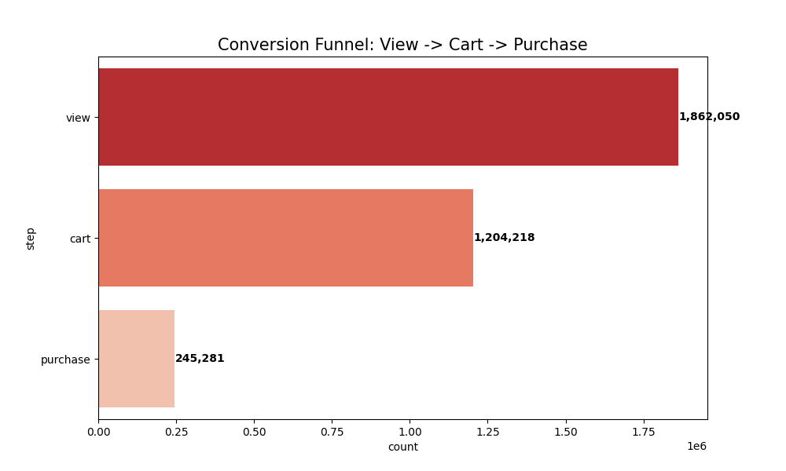

# EcoMetric Core: eCommerce Customer Behavior Analysis

EcoMetric Core is a high-performance eCommerce analytics suite that transforms over 3.9 million customer event logs into actionable growth strategies. It provides deep-dive insights into conversion funnels, customer segmentation, and behavioral patterns, all visualized through a premium web-based dashboard.



## 🚀 Features

-   **Funnel Optimization**: Identify drop-off points between viewing, carting, and purchasing.
-   **RFM Segmentation**: Categorize users into "VIPs," "Potential Loyalists," and "At Risk" segments.
-   **Behavioral Modeling**: Analyze peak activity windows (10 AM – 2 PM) and session duration impacts on conversion.
-   **Interactive Dashboard**: A modern, glassmorphism UI built with Vite and Chart.js for real-time KPI monitoring.

## 🛠️ Tech Stack

-   **Backend Analysis**: Python, Pandas, Matplotlib, Seaborn.
-   **Frontend Dashboard**: Vite, Vanilla JavaScript, CSS (Glassmorphism), Chart.js.

## 📁 Project Structure

-   `scripts/`: Python-based analysis modules (Cleaning, EDA, RFM, Behavior).
-   `dashboard/`: Vite-based web interface.
-   `reports/`: Detailed technical case studies and executive summaries.
-   `visuals/`: Automatically generated analysis charts.
-   `data/`: (Not pushed to GitHub) Cleaned and processed data files.

## 🏁 Getting Started

### 1. Run Analysis Pipeline
To refresh all statistics and regenerate visuals:
```powershell
py run_all.py
```

### 2. Launch the Web Dashboard
```powershell
cd dashboard
npm install
npm run dev
```

## 📊 Key Insights (October 2019)
- **VIP Impact**: <10% of users generate 40%+ of revenue.
- **Funnel Bottleneck**: Only 4.5% of product views result in a cart addition.
- **Conversion Peek**: Activity surges between 10 AM and 2 PM local time.

---
*Project Developed by EcoMetric Core Team for Rayan-web790.*
